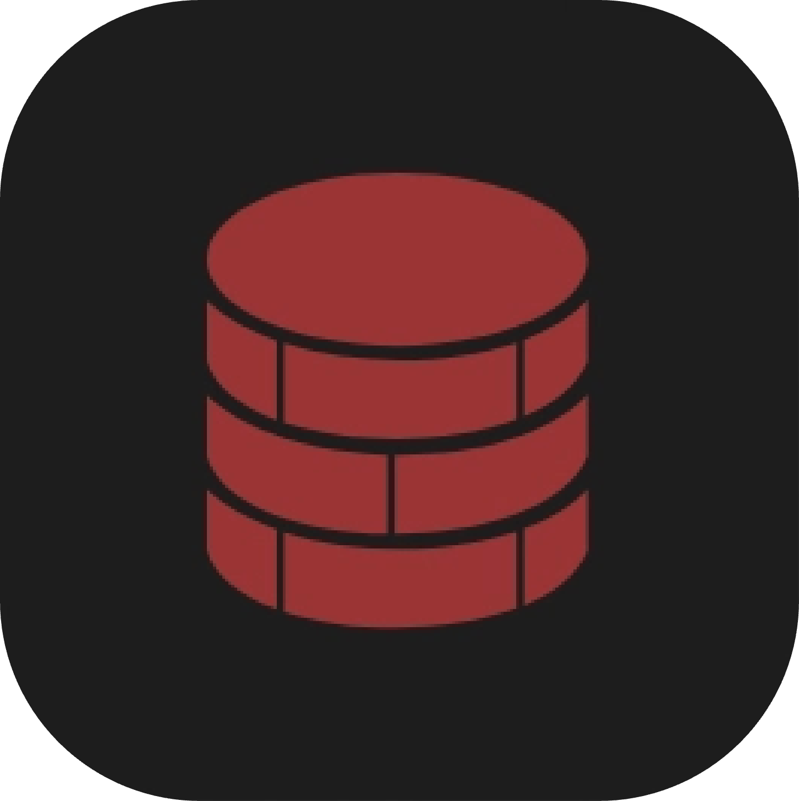
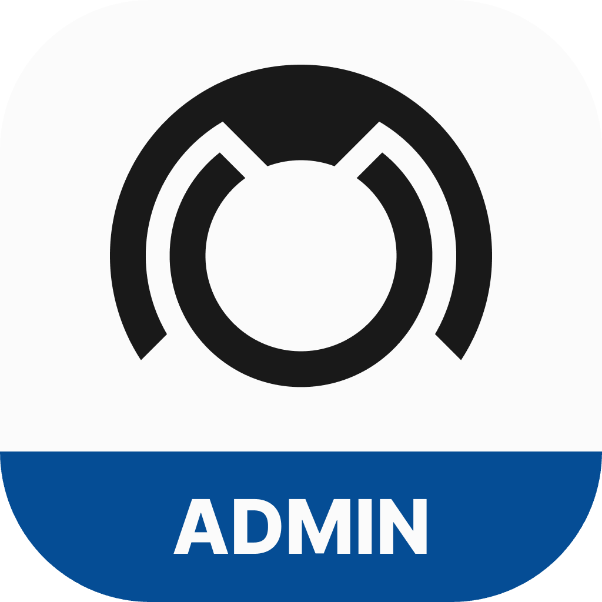

<div align="center">
  <a href="https://github.com/coderaveHQ/timeline_updater_app">
    
  </a>

  <h3 align="center">TimeLine Updater</h3>

  <p align="center">
    "UPDATES CAN BE FUN"
    <br />
    <br />
    <a href="https://app.timeline-updater.com">Web App</a>
    ·
    <a href="https://timeline-updater.com">Website</a>
    ·
    <a href="https://docs.timeline-updater.com">Documentation</a>
  </p>
</div>

---

<p align="center" style="font-size: 24px;">
  <strong>Tech Stack</strong>
</p>

<p align="center">
  
  
  
  
</p>

<strong>Usage</strong>

- [Flutter](https://flutter.dev): Multi-platform Frontend
- [Supabase](https://supabase.com/): [PostgreSQL](https://www.postgresql.org/) database and [S3](https://aws.amazon.com/de/s3/) storage
- [Brick](https://pub.dev/packages/brick_offline_first): Local cache via [SQLite](https://www.sqlite.org/)
- [Firebase](https://firebase.google.com/): Push-Notifications

---

## Activity 📊


## Overview 👓

TimeLine Updater is a software consisting of three different applications that allow users to automate software updates of the TimeLine ERP system.

### Availability

Every application is available on all platforms.

<p align="center">
  
  
  
  
  
  
</p>

### Features

- Multi-Platform
- Localization
- Theming
- Offline-First
- Transactional E-Mails
- Push-Notifications

### 3 Apps

There are three different Apps for different purposes.

<p align="center">
  <span style="display: inline-block; text-align: center; margin-right: 20px;">
    
    <br>TimeLine Updater
  </span>
  <span style="display: inline-block; text-align: center; margin-right: 20px;">
    
    <br>TimeLine Updater Admin
  </span>
  <span style="display: inline-block; text-align: center; margin-right: 20px;">
    
    <br>TimeLine Updater Customer
  </span>
</p>

In addition to that we developed a UI library called **TimeLine Updater App UI**, a utils collection called **TimeLine Updater App Utils** and a documenation page available at [TimeLine Updater Docs](https://docs.timeline-updater.com).

### Security

Since security was one of the most important aspects of this project, there are some key measures to point out:

- **Environment variables**: We use `.env` files to store secrets instead of writing them directly into the code.
- **Authentication and authorization**: Access to any data is denied by default. Users need to authenticate and authorize themselves to get access.
- **RLS**: We use [Row Level Security](https://supabase.com/docs/guides/database/postgres/row-level-security) to restrict access to every single data row.
- **RPC**: We use [Remote Procedure Calls](https://supabase.com/docs/reference/dart/rpc) instead of firing up some SQL directly against the database.
- **Automatic Tests**: We use [GitHub Actions](https://github.com/features/actions) to make sure all tests pass before merging into production.

## Installation ⚙️

The newest version of all applications can be downloaded from the offical [Website](https://timeline-updater.com).

## Roadmap 🚘

The following list contains features that will be developed.

- [ ] **Standards Delivery**: Standards will be available without the need of uploading them manually.
- [ ] **Code Change Recognition**: Repositories can be linked to a customer which allows for detection of code changes and automatic builds and uploads.

## Developer Notes 💻

### Prerequisites

You need to have the following software installed:

- [Flutter SDK](https://docs.flutter.dev/get-started/install)
- [Docker](https://www.docker.com/products/docker-desktop)
- [Supabase CLI](https://supabase.com/docs/guides/local-development/cli/getting-started?queryGroups=platform&platform=macos)

ℹ️ Docker needs to be up and running

### Environment variables

1. Copy and rename the `.env` file:
    ```bash
    cp .env.example .env
    ```
2. Fill out the values

### Spin up the Docker image

1. Change into the `supabase`folder:
    ```bash
    cd supabase
    ```
2. Start the Docker image:
    ```bash
    supabase start
    ```
3. Serve Edge Functions:
    ```bash
    supabase functions serve
    ```

### Run the App

1. Install dependencies:
    ```bash
    flutter pub get
    ```
2. Run code generation:
    ```bash
    dart run build_runner build --delete-conflicting-outputs
    ```
3. Run the App:
   ```bash
   flutter run (When device is connected or simulator is running)
   ```
   ```bash
   flutter run -d [windows, macos, linux, chrome]
   ```

## Migration Guide 🚚

In case of moving this project to the offical TimeLine Stack the following steps need to be done.

- **Server**: The server needs to be changed to another one.
- **Domain access**: The domain needs to be moved to another account.
- **Move to GitLab**: The repository needs to be moved to GitLab.
- **CI/CD**: GitHub Actions need to be rewritten to GitLab Runners.
- **Developer Accounts**: The Developer Accounts need to be changed (e.g. Apple and Google).
- **Bundle Identifiers**: The IDs need to be changed from `dev.coderave.timeline-updater`.
- **E-Mails**: The E-Mail accounts need to be changed from `timeline-updater@coderave.dev`.

---

ℹ️ *This project was created as a project for my finals in 2024/25.*